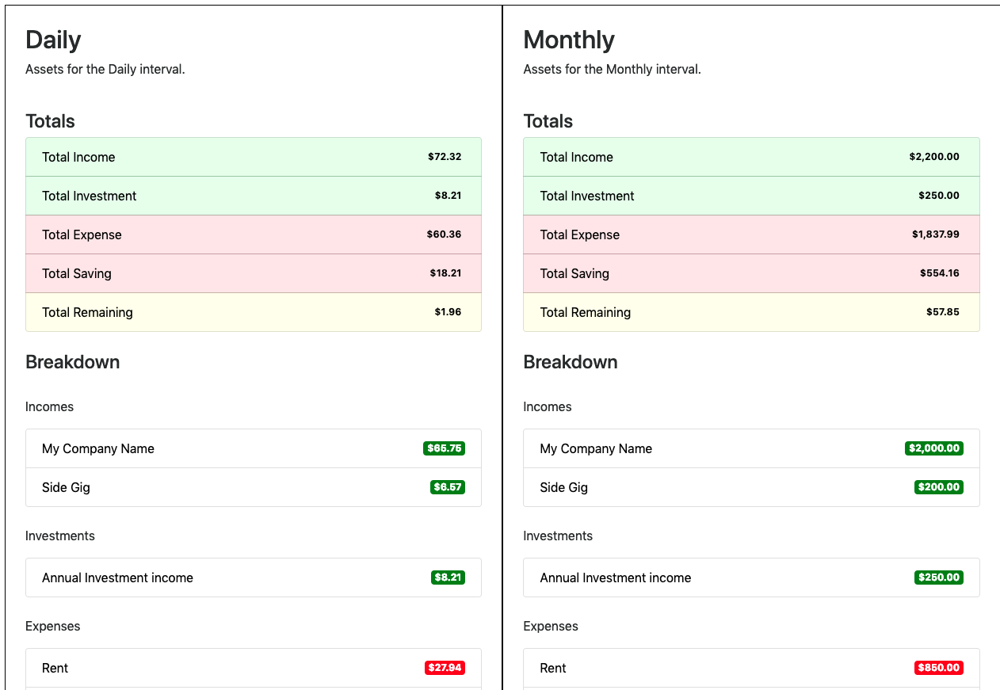

# Asset tool

[](https://travis-ci.org/Ebonsignori/asset-tool)
[](https://github.com/semantic-release/semantic-release)

**NOTE:** Only USD currently supported

This tool is geared for personal use and is not recommended / robust enough to be used in a production environment.

The workflow for using this tool is as follows:

1. Type out your income and expenses by interval (daily, monthly, annual) in a Node.js script that imports this module.
2. Run the file to calculate your total earnings and expenses per each interval.
3. Save the summary of the calculations to a pdf or html file, or simply print the summary to your console.

See [example.js](./example.js) for an example script that uses this tool to calculate a daily, monthly, and annual breakdown of your finances.

The following is an image of the html summary generated from running [example.js](./example.js).



## Usage

### Install

`npm i -s asset-tool`

Import the module

`const Asset = require('asset-tool')`

### QuickStart

Simply use [example.js](./example.js) as a template, or read on from here to learn how to setup the tool from the ground up.

### Declare your assets

`Asset.construct(amount, type, interval, label)`

- `amount`: A number value in dollars of the amount of the asset.
  - Can be an array of numbers that will be averaged. (e.g. `[200, 400]` will be averaged to `300`)
- `type`: Can be a value from `Asset.TYPE` (see [Static Values](#static-values))
- `interval`: Can be a value from `Asset.INT` (see [Static Values](#static-values))
- `label`: A string identifying the asset (e.g. 'Rent')
- `isCents`: defaults to `false`, if set to `true`, amount will be in cents.

Example

```javascript
Asset.construct(100000, Asset.TYPE.INCOME, Asset.INT.ANNUAL, 'Tech Company')
```

Example of average amounts

```javascript
Asset.construct([65, 100], Asset.TYPE.EXPENSE, Asset.INT.MONTHLY, 'Internet')
```

Example when an `amount` of $19.99 is specified in cents

```javascript
Asset.construct(1999, Asset.TYPE.EXPENSE, Asset.INT.MONTHLY, '3 payments of', true)
```

### Declare using default constructor

`new Asset(amount, {type: '', interval: '', label: ''}, isCents`

- `amount`: A number value in dollars of the amount of the asset.
  - Can be an array of numbers that will be averaged. (e.g. `[200, 400]` will be averaged to `300`)
  - Always Required
- `type`: Can be a value from `Asset.TYPE` (see [Static Values](#static-values))
  - Optional. Defaults to `Asset.TYPE.EXPENSE`
- `interval`: Can be a value from `Asset.INT` (see [Static Values](#static-values))
  - Optional. Defaults to `Asset.INT.MONTHLY`
- `label`: A string identifying the asset (e.g. 'Rent')
  - Optional. Defaults to `Unlabelled`
- `isCents`: defaults to `false`, if set to `true`, amount will be in cents.
  - Optional. Defaults to `false` (dollars)

### Include an Asset in calculations

`include()` each asset that you want to participate in final calculations. If you create assets and manipulate them with calculations, then you only want to `include()` the final asset. 

Example:

```javascript
Asset.construct([65, 100], Asset.TYPE.EXPENSE, Asset.INT.MONTHLY, 'Internet').include()
```

### View results

You can run calculations and view the breakdown of all on your `include()`'d assets from:

1. The command line.
2. A generated HTML or PDF file.

To generate an html or pdf file at the end of your script include:

```javascript
Asset.generateSummary()
```

See [Generate Summary](#generate-summary) for an overview of generating a pdf or html.

To print your totals for each interval (daily, monthly, annual) in the command line, at the end of your script include:

```javascript
Asset.printAll()
```

To print your totals and the breakdown for a specific interval, at the end of your script include:

```javascript
Asset.printInterval(interval)

// Example for monthly interval
Asset.printInterval('monthly')
```

## Generate Summary

By default, `Asset.generateSummary()` will generate an HTML file called `summary.html` in the directory that the script is run.

### PDF options

To generate a pdf you have the following options. The example shows the defaults, the comments show possible values.

```javascript
opts = {
  generatePdf: false, // true or false (if any other pdf option is specified this defaults to true)
  orientation: "portrait", // portrait or landscape
  format: "Letter", // A3, A4, A5, Legal, Letter, or Tabloid
  pdfName: "./summary.pdf" // Can be any file path string ending with .pdf
}
```

### HTML options

Additionally, you can specify the html file's path.

```javascript
opts = {
  htmlName: "./summary.html"
}
```

### Shared options

For both html and pdf summaries, the following options are available.

```javascript
opts = {
  open: false, // Open a new tab in default browser or pdf viewer on success
  noLogging: false // Don't log a success message upon summary creation
}
```

```javascript
Asset.generateSummary(opts)
```

## Static Values

```javascript
Asset.TYPE = {
  INCOME: 'income',
  EXPENSE: 'expense',
  TOTAL: 'total'
}
```

```javascript
Asset.INT = {
  DAILY: 'daily',
  MONTHLY: 'monthly',
  ANNUAL: 'annual'
}
```

## TODO

- Add Investment and Savings `Asset.TYPE`. Default remaining to Savings?
- Add automatic income tax adjustments using some sort of API?
- Add tests and CI script to run those tests
- Make more robust / less hacky
